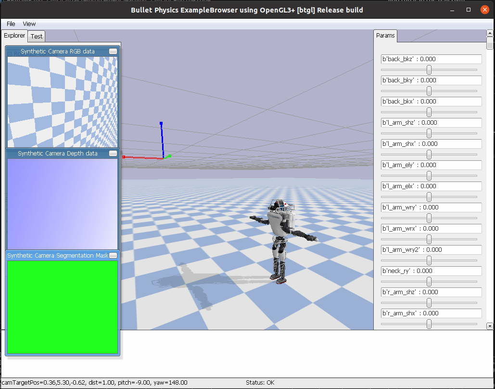

# Atlas reinforcement learning

This project aims to run reinforcement learning models on a real Atlas.

- Python version: 3.7.11

## Timeline

- [x] Run the simulated Atlas model in `PyBullet`.
- [ ] Wrap it into an OpenAI-Gym environment.
- [ ] Create a second backend for the OpenAI-Gym that connects to the real Atlas.
- [ ] Train a very basic machine learning model with `stable_baselines` in the virtual Gym and run it in the real Gym. Fix most of the joints to zero, except, for example, the right arm.
- [ ] See how the model behaves and decide on further steps.

## Setup

[Install Python 3.7](https://linuxize.com/post/how-to-install-python-3-7-on-ubuntu-18-04/). Create a virtual env (or something else).

```console
which python3.7
virtualenv -p /usr/bin/python3.7 env
source env/bin/activate
pip install -r requirements.txt
```

## Run the code

Run the following command to play around with the Atlas Robot in PyBullet.

```console
python3 atlasrl/simulator/standalone.py
```



## State, Actions and Reward

- Observed state is not clear yet.
- Actions are the pd-controller targets for the 30 joints of the simulated Atlas.
- Rewards depend on the specific task.
